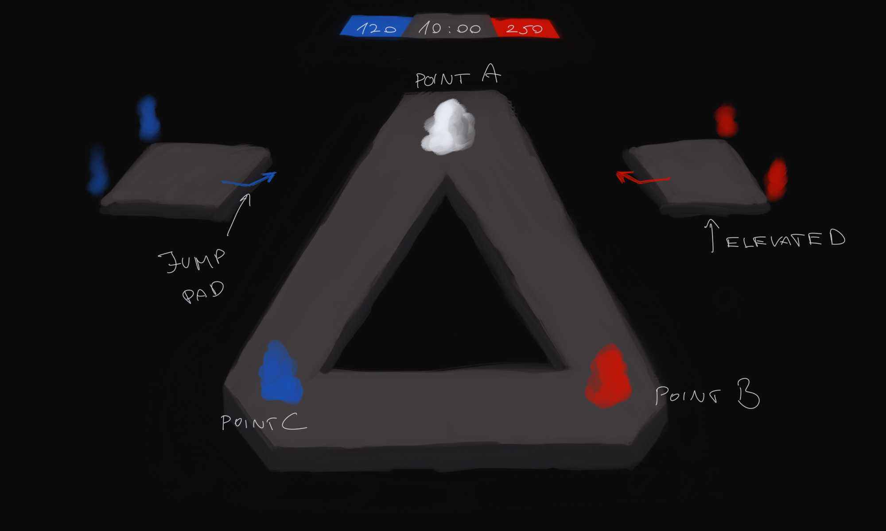

# Platforms map, and Domination Game Mode

Key features 
 - Space atmosphere -> Space skybox and harsh lighting
 - Modeled platform static mesh assets
 - Symmetrical map layout, to ensure fair gameplay
 - Odd number of capture point to prevent stalemates (make them least likely)
 - Jump pads

## What needs to be done

### Map Design

The base map is a large equilateral triangle, with a capture point at each corner. The map is symmetrical, with each team starting at the base of one of the triangle's sides.
Starting areas on the sides should float above the map, to prevent spawn camping.

From these starting points, players can use jump pads to quickly launch themselves to the capture points.

Work category:
 - UE Editor: Level design blockout,
 - Blender: Model the platforms,
 - UE Editor: Material creation for the platforms,
 - UE Editor: Lighting setup,

### Domination Game mode, a Time limited team game.

Based on the number of captured points, a team accumulates points over time. The team with the most points at the end of the match wins.
The more captured points the higher the point accumulation rate.

1: 100 point every 1 second  
2: 120 points every 1 second  
3: 130 points every 1 second  

Making accumulation rate not double and triple with points captured, to prevent snowballing, and to make it easier for the losing team to catch up.

Track the time elapsed, just like in DM and TDM, and display it on the HUD.
Track the points per team, and display them on the HUD, and in the scoreboard.

Make a hard decision about the time limit, and the point limit. 
Make a decision about: Could players earn points for their teams by killing enemies? If so, how much?

Work category:
 - C++ coding,
 - UI design and Widget Blueprint creation,

#### Capture Points

Should be placed at the corners of the map, and be visible from the starting areas. Distinct looking, large objects that are easy to spot from a distance.
Emit team colored light to indicate which team controls them.
Capturable by entering an area around them, which should also be visible and understandable if you are in it or not.

Capture rule: 
 - If a team has more players in the capture area than the other team, the point is captured by the team with more players in the area.
 - If the number of players is equal, the point is contested, and does not change sides until a majority of team members occur.
 - If a capture rule applies, capture is instant, and the point is now affecting team point accumulation.

When a player is within a capture area, display a HUD element that shows the ownership of the point.

Work category:
  - C++ coding,
  - Blender: Model the capture points,
  - UE Editor: Particle effects for the capture points,
  - UE Editor: Blueprint Actor creation,
  - UE Editor: Material creation for the capture points,

### Jump pads

Jump pads are Blueprint Actors that launch the player in a specific direction, with a specific force. 
They are placed on the map to allow players to quickly move between capture points.

Work category:
 - C++ coding,
 - Blender: Model the jump pad,
 - UE Editor: Particle effects for the jump pad,
 - UE Editor: Blueprint Actor creation,

### Fixes / changes on original gameplay mechanics

 - Fix the movement component: Players should fall off the map if they are not on a platform.

### Additional (optional) ideas

Set dressing: Add asteroids, space debris, and other space-themed objects to the map to make it feel more alive.

Gameplay: Create a new weapon or alter the primary cannon in way that it can knock back, or push enemies, maybe even allies. It could be used to push enemies off the map, or to push them into a capture area.
Could allow self boosting, by shooting the ground, or walls at the cost of some health/shield, like a rocket jump.

If someone dies from falling because of a knockback, the player who caused the knockback should get a point for the kill.

UI: Add an indicator to the UI that constantly shows the status of all the capture points, and the points per team.

